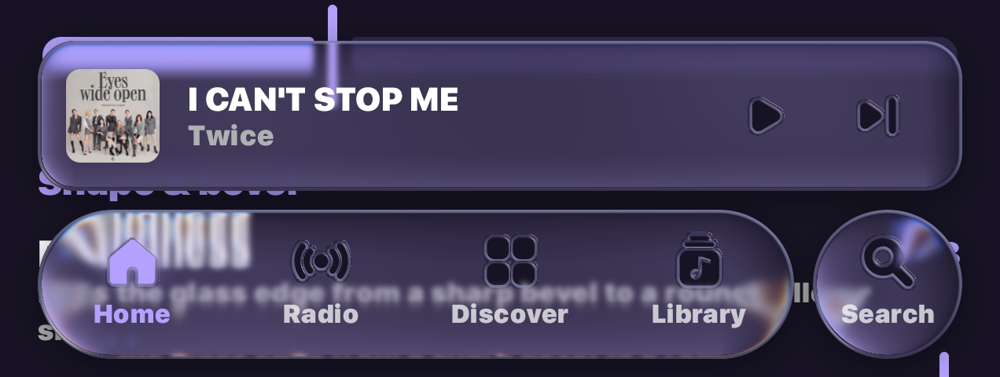

# Tryptify for Windows 1.9.3 beta

The second Windows build. It adds DJ decks with controller support and the
Android app's 1.9.3 features. Everything that used to need a touch screen now
works with a mouse and keyboard. When Windows blocks one of the app's
libraries, the app now says which one.

## Install

Download `Tryptify-1.9.3.msi` below and run it. It installs for your user only
and needs no administrator rights.

- **Coming from 1.9.3 alpha?** Uninstall it first (Settings → Apps →
  Tryptify). Both builds are version 1.9.3, so Windows won't install one over
  the other. Your library, settings and downloads are kept. They live in
  `%LOCALAPPDATA%\Tryptify\data` and your Music folder, and uninstalling
  doesn't touch either.
- The installer isn't code-signed yet. If SmartScreen says "Windows protected
  your PC", choose **More info → Run anyway**.

## New: DJ decks

Open them with the round DJ button beside Search in the nav bar (Ctrl+6), or
from the Mixer's toolbar. Back returns you to where you were. Wide windows
show deck A, the mixer and deck B side by side; narrow ones stack them.

- **Decks:** play/pause, CDJ-style cue (hold to preview), eight hot cues, auto
  loops with resize and reloop, beat jumps and needle seek. The jog scratches
  when touched and bends the pitch when not, and key lock is there too.
- **Beat grid and sync:** each track's tempo and first beat are found when it
  loads. Sync matches tempo and phase, including half and double time, and
  sync lock holds the beats together.
- **Mixer:** trim, a three-band isolator EQ with true kills, a one-knob
  low-pass/high-pass filter, channel faders with meters, a beat-phase meter and
  the crossfader.
- **FX A and FX B:** the first three effects on each FX bus, with their
  amounts, dry/wet and deck assignment. The Mixer's new **DJ console layout**
  button sets the buses up for this in one step: Mix A → FX A and Mix B → FX B,
  both into the master. Your plugins, faders and mutes stay as they were.
- **Browser:** queue, local files, liked and history, plus TIDAL, Qobuz and
  Deezer. Type to search a service's catalogue, then load a track straight onto
  a deck.
- **Controllers**, with no extra drivers:
  - The **Native Instruments Traktor Kontrol S2 MK1** connects on its own when
    plugged in, from any screen. If Traktor or NI's Controller Editor is using
    it, the app shows it as busy.
  - **Any class-compliant USB MIDI controller** works with MIDI learn (14-bit
    faders included). You can also import a Mixxx XML mapping, and a Pioneer
    DDJ-400 profile is built in. Tryptify opens only the ports it has a mapping
    for, so Traktor or Serato keep the rest.
  - Knobs and faders take over softly, so plugging a controller in or moving a
    control on screen never makes the sound jump.

## From the Android app's 1.9.3

- **Lyrics:** letters made of liquid glass, god rays streaming from the line
  being sung (under or over the glass), a soft shadow on the background, and
  nine new looks in Player Visuals Studio: Sunburst, Cathedral, Eclipse,
  Daybreak, Searchlight, Spotlight, Crepuscular, Mercury and Sea Glass.
- **Library:** folders in their real order, more sorts, path crumbs, and Play
  and Shuffle on a folder. Album grouping keeps a folder's artist.
- **Streaming:** TIDAL, Qobuz and Deezer each stream and download in their own
  quality. TIDAL Dolby Atmos has badges and a setting, and Atmos downloads are
  saved as the untouched .m4a.
- **Downloads:** saved as Artist / Album / `01. Title`, with one `cover.jpg`
  per album, and AAC files are now tagged. A failed download says why and
  whether a retry can help, and the Downloads list fills from your library
  straight away.
- **USB DAC volume:** with direct USB output (Settings → Audio → Exclusive USB
  DAC), the volume now sets the DAC's own level. Each session starts at −24 dB
  and fades in, and changes are ramped so they never click. At full level the
  stream stays bit-perfect. Ctrl+↑/↓ and M work on it too.
- **AutoEQ per device:** an AutoEQ preset can follow your USB DAC. Give it to
  all USB devices, or to one DAC by name, with the devices button on the preset.
  Windows doesn't say whether an output is speakers or headphones, so only USB
  devices are offered.
- Track rows give the title the whole line. Low performance mode draws flat
  surfaces. The legacy player fills the screen and has lyrics. Crash reports
  can be switched off in Settings › System › Diagnostics.

## Mouse and keyboard everywhere

Each swipe, long-press, drag, pinch or pull from the phone app now has a
mouse or keyboard equivalent.

- Press **F1** or **?** for the full list of shortcuts.
- **Space**, the arrow keys and Ctrl shortcuts control playback anywhere
  outside a text field. **F11** toggles full screen.
- The mouse's back and forward buttons, and Alt+←/→, move through history.
- Right-click, the Menu key or Shift+F10 opens a card's or row's menu.
  Ctrl-click and Shift-click select several rows, and Home and End jump to the
  ends of a list.
- Hovering shows a hand cursor and a rim, and keyboard focus shows a ring.
- On the player, the wheel seeks and sets the volume, and every control has a
  tooltip naming its shortcut. Click or drag the mini player's progress line to
  seek.
- The wheel and arrow keys adjust knobs and faders. Ctrl-drag for fine steps,
  and double-click or press Delete to reset.
- In search, Down moves into the results and Escape clears the field. F5
  refreshes Discover.
- In Settings, a slider takes the wheel only when it has focus, so scrolling
  the page no longer catches on it.

## Fixes

- **Startup:** when Smart App Control or an antivirus blocks one of the app's
  unsigned DLLs, Tryptify now starts without that feature and names the file.
  Before, it failed with "Failed to launch JVM". If the app can't start at all,
  a dialog names the file and what to check, and a report is written to the
  logs folder.
- **About** no longer closes the app (two of its icons were broken).
- A link or file that Windows refuses to open now shows a message instead of
  crashing the app, and a busy clipboard is retried.
- **Scrobbles name the right artist for local files.** A compilation no longer
  goes to Last.fm and ListenBrainz as "Various Artists", and "feat." credits
  are kept. The genre and year screens still keep a compilation together.
- The update check now looks for Windows releases. It used to look at the
  Android app's.

## Known limitations

- The DDJ-400 profile was written from Pioneer's documentation and hasn't been
  tried on the hardware yet, and the app marks it as unverified. If a control
  does the wrong thing, learn it again.
- Mixxx imports bring over plain bindings and LEDs. Script bindings are
  skipped, and the import says how many.
- Deck B is heard only while the DJ decks are open.
- Not on Windows: "Play alongside other apps" (Windows has no audio focus) and
  the tilt sliders for the lyric glass and god rays (no tilt sensor).

**Full changelog:**
https://github.com/tryptz/Tryptify-Windows/compare/1.9.3w...1.9.3beta
